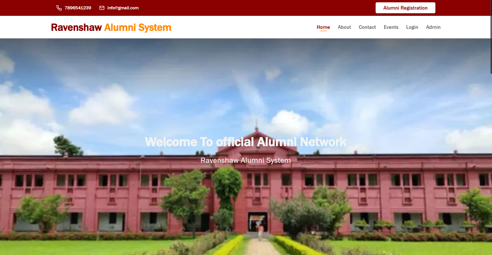

# <div align="center">🎓 Ravenshaw University Alumni Portal 🎓</div>

<div align="center">


</div>

<p align="center">
  
</p>

<div align="center">
  A comprehensive web platform connecting Ravenshaw University alumni across the globe
</div>

## 📑 Table of Contents
- [About](#about)
- [Features](#features)
- [Demo](#demo)
- [Tech Stack](#tech-stack)
- [Installation](#installation)
- [Usage](#usage)
- [Project Structure](#project-structure)
- [API Documentation](#api-documentation)
- [Contributing](#contributing)
- [License](#license)
- [Contact](#contact)

## 🎯 About <a name="about"></a>

The **Ravenshaw University Alumni Portal** is a dedicated platform designed to foster connections among alumni, current students, and faculty. The portal serves as a central hub for networking, career opportunities, event announcements, and keeping the Ravenshaw community engaged.

Founded in 1868, Ravenshaw University has a rich legacy of academic excellence and a vast alumni network spread across the globe. This portal aims to leverage this network for mutual growth, mentorship, and collaboration.

## ✨ Features <a name="features"></a>

### 👤 For Alumni:
- **Profile Management**: Create and customize personal profiles
- **Network Exploration**: Browse and connect with fellow alumni
- **Event Participation**: View and register for upcoming events
- **Job Portal**: Post job opportunities and access exclusive listings
- **News & Updates**: Stay informed about university developments
- **Gallery**: Access photos and videos from various alumni events

### 🛠️ For Administrators:
- **User Management**: Approve new registrations and manage user access
- **Event Management**: Create, update, and manage events
- **Content Control**: Moderate posts, comments, and user-generated content
- **Analytics Dashboard**: Track user engagement and platform metrics
- **Communication Tools**: Send announcements and newsletters

### 🌐 General Features:
- **Responsive Design**: Seamless experience across all devices
- **Secure Authentication**: Protected user data and privacy
- **Search Functionality**: Easy discovery of people, events, and content
- **Interactive Interface**: User-friendly navigation and interaction

## 🖥️ LIVE <a name="demo"></a>

<div align="center">
  
  [🔗 Live Project](https://ravenshaw-alumni-project-8gg3.vercel.app/)
  
  
</div>

## 💻 Tech Stack <a name="tech-stack"></a>

<div align="center">
  
  
  
  
  
  
</div>

## 📥 Installation <a name="installation"></a>

### Prerequisites
- Python 3.8 or higher
- Django
- Git

### Steps

```bash
# Clone the repository
git clone https://github.com/your-username/ravenshaw-alumni-portal.git

# Navigate to the project directory
cd ravenshaw-alumni-portal

# Create and activate a virtual environment
python -m venv venv
source venv/bin/activate  # On Windows: venv\Scripts\activate

# Install dependencies
pip install -r requirements.txt

# Run migrations
python manage.py migrate

# Create a superuser (admin)
python manage.py createsuperuser

# Run the development server
python manage.py runserver
```

## 📱 Usage <a name="usage"></a>

### For Alumni

1. **Sign Up/Login**: Create a new account or log in with existing credentials
2. **Complete Profile**: Add education history, professional experience, and personal details
3. **Explore Network**: Browse other alumni profiles based on batch, department, or location
4. **Participate in Events**: Register for reunions, workshops, or networking sessions
5. **Post Job Opportunities**: Share career openings with the community

### For Administrators

1. **Access Admin Panel**: Login with administrator credentials
2. **Manage Users**: Approve new registrations and handle user permissions
3. **Create Events**: Schedule and organize community events
4. **Moderate Content**: Review and manage user-generated content
5. **Send Communications**: Broadcast announcements to targeted alumni groups

## 📂 Project Structure <a name="project-structure"></a>

```
ravenshaw-alumni-portal/
├── alumni_portal/           # Django project directory
│   ├── settings.py          # Project settings
│   ├── urls.py              # URL configurations
│   ├── wsgi.py              # WSGI application
│   └── asgi.py              # ASGI application
├── alumni/                  # Django app directory
│   ├── migrations/          # Database migrations
│   ├── templates/           # HTML templates
│   │   └── alumni/          # Alumni-specific templates
│   ├── static/              # Static files (CSS, JS, images)
│   │   ├── css/             # Stylesheets
│   │   ├── js/              # JavaScript files
│   │   └── images/          # Image assets
│   ├── models.py            # Database models
│   ├── views.py             # View functions
│   ├── forms.py             # Form definitions
│   ├── admin.py             # Admin configurations
│   ├── urls.py              # App URL patterns
│   └── tests.py             # Unit tests
├── events/                  # Events app (if separated)
│   ├── models.py
│   ├── views.py
│   └── ...
├── manage.py                # Django management script
├── requirements.txt         # Python dependencies
├── .gitignore               # Git ignore file
├── README.md                # Project documentation
└── db.sqlite3               # SQLite database file
```

## 📚 API Documentation <a name="api-documentation"></a>

The Django admin interface provides insight into the application's data models and relationships. Once logged in as an admin user, you can access it at `/admin`. 

Key endpoints include:

- `/accounts/login/` - Alumni login
- `/accounts/register/` - Alumni registration
- `/profile/` - Profile management
- `/events/` - Event listings and details
- `/network/` - Alumni network browsing
- `/jobs/` - Job posting and searching

## 🤝 Contributing <a name="contributing"></a>

We welcome contributions from the community! To contribute:

1. Fork the repository
2. Create a feature branch (`git checkout -b feature/amazing-feature`)
3. Commit your changes (`git commit -m 'Add some amazing feature'`)
4. Push to the branch (`git push origin feature/amazing-feature`)
5. Open a Pull Request

Please read our [Contributing Guidelines](CONTRIBUTING.md) for more details.

## 📄 License <a name="license"></a>

This project is licensed under the GNU General Public License v3.0 - see the [LICENSE](LICENSE) file for details.

## 📞 Contact <a name="contact"></a>

<div align="center">

[](https://github.com/your-username)
[](mailto:contact@example.com)
[](https://www.ravenshawuniversity.ac.in)

**Ravenshaw University**  
College Square, Cuttack, Odisha, India - 753003

</div>

---

<div align="center">
  <sub>Built with ❤️ by Ravenshaw University students</sub>
</div>
